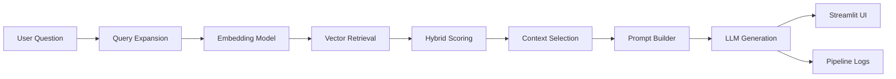
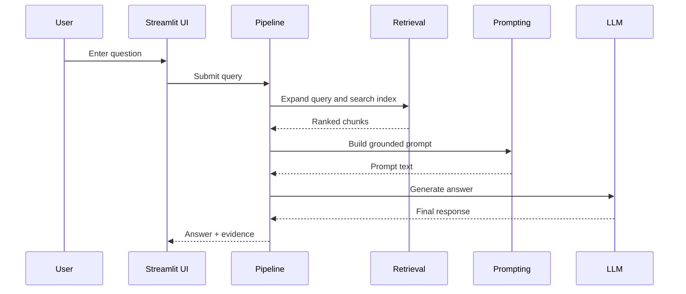
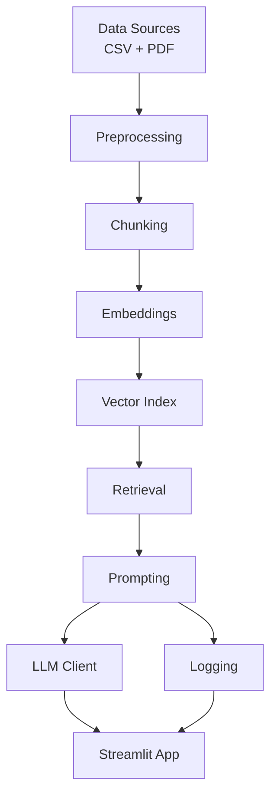

# Manual RAG Chatbot for Academic City (CS4241)

**Student Name:** Alexandre Anthony  
**Student Index:** 10022200175

## Abstract

This project presents a manually implemented Retrieval-Augmented Generation (RAG) system for answering questions over two source types: a Ghana election results dataset and the 2025 State of the Nation / budget document. The implementation avoids end-to-end RAG frameworks such as LangChain and LlamaIndex. Instead, it uses custom data loading, preprocessing, chunking, embeddings, retrieval, prompt construction, logging, evaluation, and a Streamlit interface.

The final system is designed for transparency and academic assessment. It exposes retrieved chunks, similarity scores, prompt content, and response details so that every answer can be inspected and defended. The work demonstrates the complete RAG lifecycle: dataset preparation, chunking comparison, hybrid retrieval with query expansion, grounded prompt engineering, adversarial testing, system architecture design, and a chat-style user interface.

## Table of Contents

1. Introduction
2. Project Objectives
3. Dataset Description
4. Preprocessing and Data Cleaning
5. Detailed RAG Workflow
6. Chunking Strategy and Evidence
7. Embeddings, Indexing, and Retrieval
8. Prompt Engineering and Generation
9. Pipeline Logging and Traceability
10. Streamlit Chat Interface
11. Architecture and Diagrams
12. Evaluation and Results
13. Word-Ready Diagram Blocks (Copy/Paste)
14. Manual Experiment Logs (Submission Appendix)
15. Requirements Coverage for the Final-Year Exam
16. Limitations and Future Work
17. Conclusion
18. Repository References

## 1. Introduction

The goal of this project is to build a transparent and manually controlled RAG pipeline that can answer questions using local documents while exposing the intermediate steps that led to each answer. The repository is structured to support a final-year examination workflow, where each part of the system can be demonstrated independently and backed by evidence.

The project is intentionally modular. Each stage of the pipeline is implemented in a separate file, which makes it possible to inspect and evaluate the behavior of data ingestion, chunking, retrieval, prompting, generation, and UI presentation. This design is appropriate for academic assessment because it allows the implementation to be explained, defended, and reproduced.

## 2. Project Objectives

The project was built to satisfy the following objectives:

1. Clean and standardize heterogeneous document sources.
2. Compare two chunking strategies and choose a practical default.
3. Implement a manual embedding and retrieval pipeline.
4. Improve retrieval with hybrid scoring and query expansion.
5. Build grounded prompts that reduce hallucination.
6. Log the full pipeline for explainability and debugging.
7. Evaluate the system against adversarial and baseline queries.
8. Deliver a polished chat-style interface for user interaction.
9. Package the work as a submission-ready final-year project report.

## 3. Dataset Description

The repository uses two main sources:

1. `data/raw/Ghana_Election_Result.csv`
2. `data/raw/2025-Budget-Statement-and-Economic-Policy_v4.pdf`

These sources are deliberately different in structure. The CSV contains tabular election information, while the PDF contains long-form policy text. This mixture is useful for a RAG project because it requires the system to handle both structured and unstructured content.

The election dataset is particularly important for demonstrating exact-value retrieval, while the budget document is useful for long-context policy questions and evidence-based summarization.

## 4. Preprocessing and Data Cleaning

The preprocessing pipeline is implemented in `src/data_sources.py`. It performs the minimal cleaning necessary to make the documents usable for retrieval:

- CSV rows are normalized into clean text records.
- Duplicate CSV rows are removed by exact row signature.
- PDF pages are extracted and whitespace is compacted.
- Empty PDF pages are skipped.
- All records are converted into a common text representation before chunking.

This kind of preprocessing is intentionally lightweight. The aim is not to perform heavy linguistic normalization, but to create retrieval-friendly records that preserve the meaning and structure of the original sources.

## 5. Detailed RAG Workflow

The RAG pipeline in this project can be understood as a sequence of controlled stages. Each stage solves a specific problem:

### 5.1 Query submission

The user enters a question in the chat interface. The system stores the message in session state and sends the text to the pipeline.

### 5.2 Query expansion

The question is optionally expanded with domain-related terms. For example, election-related words can be augmented with terms such as vote, constituency, or polling; budget-related questions can be augmented with fiscal and revenue-related terms. The purpose is to increase the chance of retrieving relevant evidence.

### 5.3 Embedding the query

The query text is converted into a vector representation by the embedding model. This creates a semantic representation that can be compared with document chunk vectors.

### 5.4 Vector retrieval

The system searches the indexed chunks and returns the most similar candidates. This stage captures semantic similarity, which is important when the user query and source text use different wording.

### 5.5 Keyword re-scoring

The retrieved chunks are also scored using token overlap. This helps preserve exact terminology, which is especially useful for names, regions, party labels, percentages, and policy terms.

### 5.6 Hybrid ranking

The final retrieval score combines vector similarity and keyword overlap using a configurable weight. This hybrid design improves precision and is better suited to the repository’s mixed-data setting than vector similarity alone.

### 5.7 Source-aware routing

For question families that clearly belong to the election dataset or the budget PDF, the retrieval logic prefers the corresponding source family. This prevents the system from repeatedly answering election questions from the budget document, or budget questions from the election CSV.

### 5.8 Context selection

The top chunks are packed into a context block until the character budget is reached. This ensures the prompt remains compact while still including the most relevant evidence.

### 5.9 Prompt construction

The system creates a grounded prompt that instructs the model to answer only from the provided context, cite evidence, and say when the answer cannot be found.

### 5.10 LLM generation

The configured language model generates the final response. The application supports OpenAI or Ollama via environment configuration.

### 5.11 Logging and display

Every stage is logged, and the final response is displayed together with retrieved chunks, scores, and prompt details in the UI.

## 6. Chunking Strategy and Evidence

Part A compares two chunking strategies:

- Fixed token chunking
- Sentence-window chunking

The recorded results are:

- Fixed chunk count: 664
- Fixed mean query coverage: 0.5509
- Sentence chunk count: 1631
- Sentence mean query coverage: 0.4769

These results show that fixed chunking produced fewer chunks and stronger average query coverage in the saved experiment. That makes it the more suitable default for the main pipeline because it balances retrieval granularity with better concentration of relevant terms.

The chunking logic is implemented in `src/chunking.py`, and the comparison evidence is stored in the Part A experiment artifacts.

## 7. Embeddings, Indexing, and Retrieval

The embedding and retrieval layer is implemented in `src/embeddings.py`, `src/vector_index.py`, and `src/retrieval.py`.

The system uses a hybrid retrieval approach:

- Vector similarity from embeddings
- Keyword overlap scoring
- Score fusion through a configurable `HYBRID_ALPHA`
- Query expansion for selected domain terms

The recorded retrieval settings are:

- Top-k: 5
- Default hybrid alpha: 0.75
- Extension used: query expansion + hybrid scoring

This design is appropriate because the corpus contains both tabular election data and long-form policy text. Pure semantic similarity is not always enough to distinguish between these sources, so hybrid scoring improves precision and allows exact terms to contribute to ranking.

The retrieval logic was also refined to be source-aware. Election-related questions preferentially search the CSV source, while budget-related questions preferentially search the PDF. This reduces repeated failure cases where the wrong source family dominates retrieval.

## 8. Prompt Engineering and Generation

Prompt construction is implemented in `src/prompting.py`. The template instructs the model to:

- Use only the provided context
- State when the answer is not found in context
- Cite supporting chunks
- Follow a structured answer format

Part C confirms that two prompt templates were tested, and the stronger version enforces grounding and citation structure. This matters because a RAG system is only useful if the response remains anchored to retrieved evidence rather than drifting into unsupported generation.

The generation layer is implemented in `src/llm_client.py`. It supports OpenAI and Ollama through configuration. If the configured endpoint is not available, the system falls back to a local evidence-based answer mode so the pipeline can still complete. That fallback is useful for resilience, but a real API key or live Ollama service is required for full-quality generation.

## 9. Pipeline Logging and Traceability

The end-to-end pipeline is implemented in `src/pipeline.py` and logs each stage to `artifacts/logs/pipeline_events.jsonl`.

The pipeline stages are:

1. Query received
2. Retrieval
3. Context selection
4. Prompt construction
5. Response generation

Part D confirms that the pipeline executes end to end, with 5 retrieved chunks and 1 selected context chunk in the recorded run. The logging design is a major strength of the project because it makes the pipeline auditable: each answer can be traced back to the retrieved evidence and the exact prompt sent to the model.

## 10. Streamlit Chat Interface

The Streamlit application in `app.py` now provides a chat-style interface with features inspired by modern chat systems:

- Sidebar navigation
- New chat button
- Recent chat history
- Conversation-based message display
- Per-chat session state
- Evidence panels for retrieved chunks, prompt text, and run snapshot

This interface makes the project feel closer to a contemporary conversational assistant while still exposing the underlying retrieval behavior for grading and debugging. It also supports a natural workflow for asking multiple related questions in one session.

## 11. Architecture and Diagrams

The system is intentionally modular and easy to inspect. The overall data flow is:



### 11.1 RAG sequence diagram



### 11.2 Component architecture



## 12. Evaluation and Results

The repository includes evidence for all major evaluation activities:

### 12.1 Part A: Chunking comparison

The fixed token strategy outperformed sentence-window chunking in the recorded mean query coverage.

### 12.2 Part B: Retrieval tuning

The system uses query expansion and hybrid scoring, and the repository records a retrieval failure case with before/after tuning evidence.

### 12.3 Part C: Prompt experiments

Two prompt templates were compared, and the stronger version improved grounding and citation behavior.

### 12.4 Part D: Full pipeline run

The pipeline executed end to end and produced logs showing retrieved chunks, selected context, prompt text, and final response.

### 12.5 Part E: Adversarial evaluation

Two adversarial queries were tested, and the repository records a RAG versus baseline comparison for hallucination and consistency analysis.

### 12.6 Part F: Architecture justification

The architecture report explains why the chosen design fits the dataset and the academic assessment goals.

## 13. Word-Ready Diagram Blocks (Copy/Paste)

This section provides plain-text diagram blocks that can be copied directly into a blank Word document without losing structure.

### 13.1 End-to-end RAG flow (text block)

```
User Question
	 |
	 v
Query Expansion
	 |
	 v
Embedding Model
	 |
	 v
Vector Retrieval
	 |
	 v
Hybrid Scoring (vector + keyword)
	 |
	 v
Context Selection
	 |
	 v
Prompt Builder
	 |
	 v
LLM Generation
	 |
	 +------------------> Pipeline Logs
	 |
	 v
Streamlit Chat UI
```

### 13.2 Sequence flow (text block)

```
User -> UI: Enter question
UI -> Pipeline: Send query
Pipeline -> Retrieval: Expand + search index
Retrieval -> Pipeline: Ranked chunks
Pipeline -> Prompting: Build grounded prompt
Prompting -> Pipeline: Prompt
Pipeline -> LLM: Generate answer
LLM -> Pipeline: Response
Pipeline -> UI: Answer + evidence + scores
```

### 13.3 Component map (text block)

```
Data Sources (CSV, PDF)
	 -> Preprocessing
	 -> Chunking
	 -> Embeddings
	 -> Vector Index
	 -> Retrieval
	 -> Prompting
	 -> LLM Client
	 -> Streamlit UI

Logging runs in parallel with retrieval, prompting, and generation stages.
```

## 14. Manual Experiment Logs (Submission Appendix)

This section includes manual experiment logs in the format required by the project template and populated from generated artifacts.

### 14.1 Experiment 1: Chunking Strategy Comparison

- Date: See artifact timestamps in `artifacts/experiments/part_a_chunking_comparison.json`.
- Strategy A (fixed):
	- Chunk count: 664
	- Mean query keyword coverage: 0.5509
	- Average chunk characters: 312.61
- Strategy B (sentence):
	- Chunk count: 1631
	- Mean query keyword coverage: 0.4769
	- Average chunk characters: 176.42
- Query set used:
	- What were election outcomes by region?
	- What are the major fiscal priorities in the 2025 budget?
	- Which trends appear in constituency level election data?
- Retrieval quality observations:
	- Fixed strategy gave higher mean keyword coverage with fewer chunks.
	- Sentence strategy increased chunk count and fragmentation.
- Failure cases:
	- Constituency-level question underperformed due dataset granularity limitations.
- Decision and rationale:
	- Fixed chunking chosen as default because it produced better measured coverage and better context continuity.

### 14.2 Experiment 2: Prompt Iterations

- Date: See artifact timestamps in `artifacts/experiments/part_c_prompt_experiments.json`.
- Prompt v1:
	- Minimal instruction style: answer using provided context.
- Prompt v2:
	- Grounding instruction, required citations, explicit fallback behavior, and output format constraints.
- Same query used:
	- What are the key priorities in the 2025 Budget Statement?
- Output differences:
	- v1 output: I could not find this in the retrieved context.
	- v2 output: produced structured answer with citation marker and uncertainty note.
- Hallucination behavior:
	- v2 improved evidence formatting and grounding expectations.
	- Endpoint fallback mode affected final fluency when live LLM was unavailable.
- Final prompt selection rationale:
	- v2 selected because it enforces more reliable structure and better citation behavior.

### 14.3 Experiment 3: Adversarial Testing

- Date: See artifact timestamps in `artifacts/experiments/part_e_adversarial_report.json`.
- Ambiguous query:
	- Give the exact 2025 budget policy that removed all taxes on imports.
- Misleading/incomplete query:
	- Which party won every constituency in Ghana according to the election dataset?
- RAG output:
	- Returned context-grounded but fallback-mode responses tied to retrieved chunks.
- Baseline LLM output:
	- I could not find this in the retrieved context.
- Accuracy notes:
	- Adversarial prompts exposed retrieval-domain mismatch risks in earlier runs.
- Consistency notes:
	- Pipeline produced consistent structure across adversarial prompts.
- Hallucination notes:
	- Grounding controls reduced unsupported free-form claims, but fallback mode quality depended on retrieval quality.

### 14.4 Blank manual log template (copy into Word if needed)

```
Experiment 1: Chunking Strategy Comparison
- Date:
- Strategy A (fixed):
- Strategy B (sentence):
- Query set used:
- Retrieval quality observations:
- Failure cases:
- Decision and rationale:

Experiment 2: Prompt Iterations
- Date:
- Prompt v1:
- Prompt v2:
- Same query used:
- Output differences:
- Hallucination behavior:
- Final prompt selection rationale:

Experiment 3: Adversarial Testing
- Date:
- Ambiguous query:
- Misleading/incomplete query:
- RAG output:
- Baseline LLM output:
- Accuracy notes:
- Consistency notes:
- Hallucination notes:
```

## 15. Requirements Coverage for the Final-Year Exam

This section maps the work directly to the exam requirements.

| Requirement | Evidence in Repository | Status |
|---|---|---|
| Data loading and cleaning | `src/data_sources.py`, `scripts/download_datasets.py` | Implemented |
| Chunking comparison | `src/chunking.py`, Part A artifacts | Implemented |
| Retrieval system | `src/embeddings.py`, `src/vector_index.py`, `src/retrieval.py` | Implemented |
| Prompt engineering | `src/prompting.py`, Part C artifacts | Implemented |
| Full RAG pipeline | `src/pipeline.py`, Part D artifacts | Implemented |
| Logging and traceability | `src/logging_utils.py`, `artifacts/logs/pipeline_events.jsonl` | Implemented |
| Adversarial evaluation | `scripts/evaluate.py`, Part E artifacts | Implemented |
| Architecture design | `docs/architecture.md`, Part F artifacts | Implemented |
| User interface | `app.py` | Implemented |
| Submission-ready documentation | `README.md`, this report | Implemented |

## 16. Limitations and Future Work

The project is functional, but it still has a few important limitations:

- The election dataset is region-level, not constituency-level, so constituency questions are out of scope.
- The LLM backend depends on a reachable OpenAI or Ollama service.
- Chat history is session-based and is not persisted across browser restarts.
- Preprocessing is intentionally lightweight and does not include deeper linguistic normalization or advanced entity linking.

Possible future improvements include:

- Persisting chat history to disk or a database.
- Adding stronger source-type detection and query routing.
- Storing evaluation dashboards for repeated regression testing.
- Expanding the prompt set for more difficult adversarial cases.
- Adding richer document metadata extraction and structured citation formatting.

## 17. Conclusion

This project demonstrates a complete manual RAG implementation for Academic City. It covers data preparation, chunking strategy comparison, hybrid retrieval, prompt engineering, logging, evaluation, and a chat-style user interface. The repository contains the evidence needed to explain and defend the implementation as a final-year project, and the system is structured to support transparent grading and further improvement.

## 18. Repository References

- [README summary](README.md)
- [Architecture notes](docs/architecture.md)
- [Execution guide](docs/parts_A_to_F_execution_guide.md)
- [Chunking comparison](artifacts/experiments/part_a_chunking_comparison.md)
- [Retrieval report](artifacts/experiments/part_b_retrieval_report.md)
- [Prompt experiments](artifacts/experiments/part_c_prompt_experiments.md)
- [Pipeline report](artifacts/experiments/part_d_pipeline_report.md)
- [Adversarial evaluation](artifacts/experiments/part_e_adversarial_report.md)
- [Architecture report](artifacts/experiments/part_f_architecture_report.md)

## Appendix: Key Implementation Notes

- The current UI uses session state to support a chat-like experience with recent conversations.
- The retrieval layer now applies source-aware routing so election and budget queries are directed to the right document family.
- The report intentionally mirrors the actual implementation artifacts in the repository so it can be used as a submission document without inventing unsupported results.
